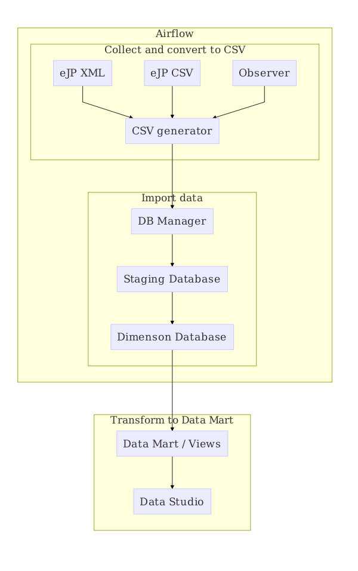

# data-pipeline

A central place for resources relating to the eLife Data Pipeline tools

## Pre-requisites

* [Docker](https://www.docker.com/) and [Docker Compose](https://docs.docker.com/compose/)

## Pipeline

The following diagram illustrates the pipeline:



The main parts are:

* Collect and convert to CSV using [csv-generator](csv-generator)
* Import CSV into 'Data Lake' and manage SCD using [db-manager](db-manager)
* Transform to Data Mart / Views for Analytics, Visualisation, etc.

To update the chart you could run:

```bash
docker run --rm -v "$PWD":/data:z felixlohmeier/mermaid -p -w 600 pipeline.mmd
```

## CSV Generator

### Convert Example Data using Docker

```bash
docker-compose run --rm csv-generator --source-zip '/example-data/xml-set-1' --output-dir '/csv-data'
```

List converted files:

```bash
docker-compose run --rm --entrypoint 'sh -c' csv-generator 'ls -l /csv-data'
```

To view one of the generated CSV files:

```bash
docker-compose run --rm --entrypoint 'sh -c' csv-generator \
  'cat /csv-data/1514862245_manuscripts.csv'
```

To copy one of the generated CSV files:

```bash
mkdir -p ./output && docker-compose run --rm --entrypoint 'sh -c' csv-generator \
  'cat /csv-data/1514862245_manuscripts.csv | tr -d "\r"' > ./output/1514862245_manuscripts.csv
```

## DB Manager

### Initialise Database

```bash
docker-compose run --rm db-manager python -m db_manager teardown &&
docker-compose run --rm db-manager python -m db_manager create
```

### Stage and Import Dummy Example

Convert dummy examples:

```bash
docker-compose run --rm db-manager python -m db_manager import-data --source-dir /dummy_csv
```

### Stage and Import Converted CSVs

```bash
docker-compose run --rm db-manager python -m db_manager import-data --source-dir /csv-data
```

### Inspect Results

```bash
docker-compose exec db psql --user elife_ejp -c 'select * from dim.dimManuscriptVersion;'
```

## Airflow

Note: You will need to initialise the database if it is the first time spinning this up:

```bash
docker-compose run --rm db-manager python -m db_manager teardown &&
docker-compose run --rm db-manager python -m db_manager create
```

Start up:

```bash
docker-compose up --build
```

Access the `airflow` admin console at http://localhost:8086/admin

Access the `celery-flower` console at http://localhost:5555
