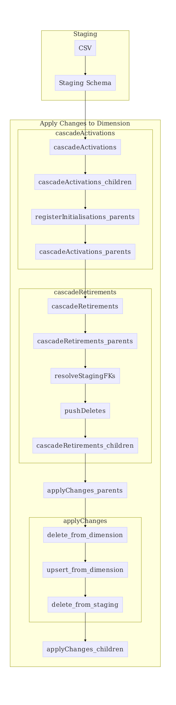
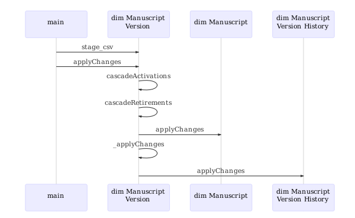
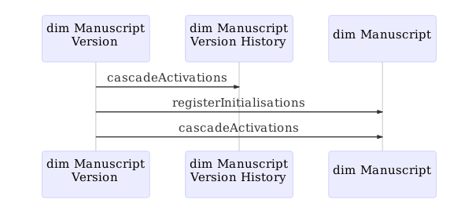
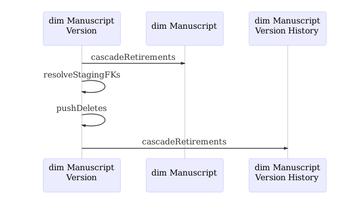
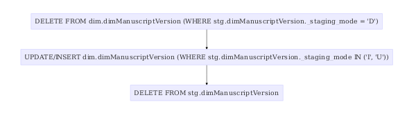

# Data Import

## General data import steps flow

The following diagram illustrates the steps involved when importing data. The exact steps may vary depending on the dimension module.



## Manuscript Version

The manuscript version is a good example as it has parent and child dependencies.

### Manuscript Version - stage_csv and applyChanges



### Manuscript Version - cascade activations



### Manuscript Version - cascade retirements



### Manuscript Version - _applyChanges



## Methods

### stage_csv

Imports the CSV produced by the _csv-generator_ into the _staging schema_ (`stg`) of the database. The data is mostly imported as-is with little transformation (if any).

### applyChanges

After staging the data using _stage_csv_, _applyChanges_ is responsible for applying the staged data to the _dimension schema_ (`dim`) of the database. It utilise methods described in the following sections to for example identify which records should be updated or added, populate foreign keys etc.

### cascadeActivations

This is mainly equivalent to _registerInitialisations_ but for specific dimension modules and is also responsible to call _cascadeActivations_ on the parent and child dependencies.

Note: within the _staging schema_.

### registerInitialisations

Create dummy records for relationships that should be there but weren't provided in the source data. e.g. the _manuscript version_ was described but there isn't a _manuscript_ itself didn't appear yet. In that case it will create a dummy _manuscript_.

Note: within the _staging schema_.

### cascadeRetirements

This is mainly equivalent to _pushDeletes_ but for specific dimension modules and is also responsible to call _cascadeActivations_ on the parent and child dependencies.

### pushDeletes

Marks entities for deletion, unless it's marked for insertion.

Note: within the _staging schema_.

### resolveStagingFK

Resolves the _id_ of the entity by comparing the corresponding external reference. e.g. find the existing _manuscript id_ for the external manuscript reference.

Note: within the _staging schema_.

## Update diagrams

To update the diagrams you could run:

```bash
docker run --rm -v "$PWD":/data:z felixlohmeier/mermaid -p -w 600 *.mmd
```
